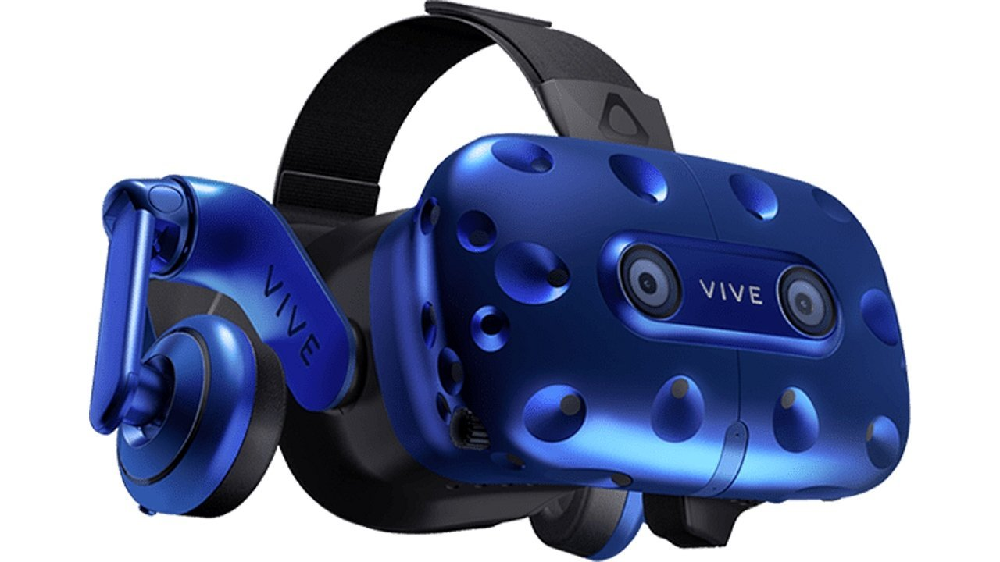

# Virtual Reality

---
Question ? | Answer ! |
--- | --- |
original writer | Ajay Jajoo
Additional writer | Jatin
Editor | Jatin
status | Writing & Review complete, proofread by ashita
Plagiarism | None 0% [Report link](./plag_reports/plag_VR_v2.pdf)
Content | tech > V tech > VR > desining > Uses > CES 2018 HTC Vive Pro
Verdict | Good Candidate. HD image included. One Page article. Adjust image at top or something.
---

The reality is often far more interesting than fiction. In the past, Who would have imagined the technology that we have so easily accessible today? 
Do you want to talk to someone far away? You have your mobile phone. Do you want to meet them? You have your car.
But what if, you can meet them virtually, without ever leaving your home. And not just meet, experience their company, visit their house, go to places with them. What if you could explore the surface of Mars? Swim with dolphins? Fly a fighter jet?

All of these are now possible with Virtual Reality.
Virtual Reality is a fully immersive computer-simulated environment. VR is supposed to transpose the user from one place to another. 
One of the most popular ways to experience virtual reality is through headsets. VR Headset devices use a stereoscopic display to make what we see 3-dimensional and to give depth to the image we are looking at. However, to be fully immersive, and truly change our perception of reality, there has to be a certain level of virtual interactivity. We should be able to freely navigate in the virtual world, so we don't feel like just a 3D movie.

But how do designers create a virtual environment?
Our brain expands on our past experience to create rules by which we translate the world. For instance, the sky discloses us which path is up. 
Shadows disclose to us where light is originating from. 
The relative size of things reveals us, which one is far away from us. Shading and texture ought to enable us to decide its deepness and
separation. These rules enable our brain to work all the more proficiently.
VR designers take these standards and attempt to give a similar data to our mind in the virtual world.

VR was initially implemented in gaming to give FPS games a new level of interactivity. It has been used for flight simulations for pilots, training simulations for soldiers, and for surgical training virtually. Scientists are investigating whether VR can change social states of mind by helping an individual see the world from an alternate individual's perspective.

In CES 2018, HTC announced a new high-resolution VR headset - Vive Pro. 
The HTC Vive Pro is a massive upgrade over the initial VR hardware.
A dual-OLED display with a resolution of 2880x1600. The crisp resolution will negative one of the complaints about VR headsets - reading small text. 
One would think that the increased resolution might have increased the lag in the headset. But No, the Vive Pro worked exactly as it should. With integrated headphones, it is supposedly better than the previous market leader, Oculus Rift. Nevertheless, the future of VR is bright, and its launch at CES implied that it'll soon be accessible to everyone. 

