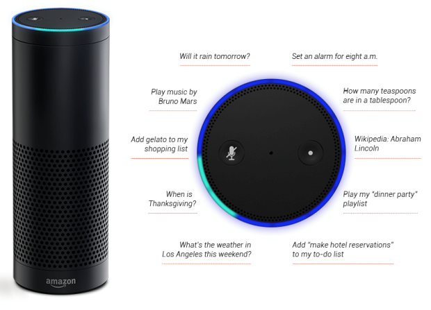

# Smart Home Devices

---
Question ? | Answer ! |
--- | --- |
writer | Lakshay
Editor | Ashita
Status | Review Complete
Plagiarism | None 0% [Report link](./plag_reports/plag_5G.pdf)
Content | SMART DEVICES > AMAZON ALEXA > GOOGLE HOME
Verdict | GOOD CANDITATE. Relevant Image included.
---

Building an ingenious lifestyle begins with developing a smarter environment. It is believed that human speech evolution took around 2 million years, however, it took less than a century for computers to understand human language. Today, with just a touch, a word or even a gesture, we can control almost any device. All the electronic products are now becoming a part of this vastly connected world. Thus, the amount of data that is being generated is gargantuan! 

According to a report from IBM Marketing Cloud, in last two years, 2.5 quintillion bytes of data is being generated every day, which contributes to 90% of the data present in the world. For all these mind-boggling and overwhelming quantity of data, Internet of Things (IoT) is to be blamed. Although IoT, big data, Artificial Intelligence (AI), and Machine Learning (ML) are some of the buzzwords of the century, the amalgamation of these emerging technologies has led to the birth of smart home devices.

Consumer Electronics Show (CES) 2018 held in Las Vegas, NV, United States, successfully put up a show which displayed the electronic devices developed from the advanced technologies and algorithms of computer science. One of the categories was smart home devices which consisted of a speech recognition device, called, Alexa.  Alexa is the name given by the   Amazon’s developers to its artificially intelligent smart speaker. Amazon echo, featuring Alexa, was first launched on 6 November 2014 in the United States. And with its launch, it immediately became a new member of the family for most of the American citizens. Alexa’s powerful speech recognition system, swift response, and huge skill market are some of the factors for its immediate success. Uptil November 2017, 8.2 million people had bought the Amazon’s new product. Alexa didn’t just help the customers but also the company, as 6% hike was noted in purchases made by the people who bought the Amazon Echo device. Perhaps, the ease of access and the gratification gained by ordering a product with just a voice command has led to the increase in profits of the company.
 
Even though Alexa can do almost anything from controlling your home appliances to booking a flight with just your voice, it is not the only device with voice user interface as its frontend. Google Home released in the year 2016 and recently launched Apple’s HomePod are already in the race. Although, Amazon got a head-start and dominated the market for almost a year but Google is not lagging behind.
Google has already established partnerships with Nest, Honeywell, SmartThings, Wink, Belkin WeMo, Philips Hue, Lifx, Lutron, August, Logitech Harmony, Anova, IFTTT and many more! Not only that, Google Home is the cheapest and the only device out of all three which offers a customizable appearance and synced audio playback to multiple devices via Google cast. 

As quoted by William Barrett, “The computer only gives back ourselves. It is a faithful mirror that reflects the human traits that are brought to it.” Therefore, with constantly evolving technology, the day isn’t far when the current generation will fall in love with their operating systems – Samantha (the movie “Her”).